# ghglance

> Generate SVG cards summarizing a GitHub user's profile — written in Go.

[](https://github.com/marketplace/actions/ghglance)
[](https://github.com/tiennm99/ghglance/releases/latest)
[](./LICENSE)

`ghglance` is a single-binary CLI (and a GitHub Action wrapping it) that fetches
data for a GitHub user and writes a themed set of SVGs you can embed in your
profile README. The same binary can also [run as a web UI](#run-the-web-ui)
where anyone submits a username and gets the cards back.

Marketplace listing: **[ghglance](https://github.com/marketplace/actions/ghglance)** · Source: [`tiennm99/ghglance`](https://github.com/tiennm99/ghglance)

Cards rendered:

| # | Card | What it shows |
| --- | --- | --- |
| 0 | Profile details | Login (Name) title + Octicon-labelled rows for company, location, link, join date (with age), followers/following, repo count |
| 1 | Repos per language | Donut + legend: how many owned non-fork repos use each language as primary |
| 2 | Most commit language (last year) | Donut + legend: last-year commits byte-weighted across each repo's language breakdown |
| 3 | Stats | Star, commit (lifetime + last-year), PR, issue, PR-review, contributed-to totals |
| 4 | Productive time (last year) | 24-hour bar chart with axes, title includes `UTC±N.NN` |
| 5 | Productive weekday (last year) | 7-bar day-of-week chart, peak day highlighted |
| 6 | Contributions (last year) | Smooth monthly area chart, Y-axis mirrored both sides, `mm/yy` labels |
| 7 | Contributions heatmap | Classic 7×53 calendar grid with theme-derived intensity ramp and legend |
| 8 | Top starred repos | Top 7 owned non-fork repos by ⭐, language dot + proportional bar |
| 9 | Streak | Current streak, longest streak, active days / total days with date ranges |
| 10 | **Most commit language (all time)** | Same as #2 but over lifetime commits |
| 11 | **Productive time (all time)** | Same as #4 but over lifetime commits |
| 12 | **Productive weekday (all time)** | Same as #5 but over lifetime commits |
| 13 | **Contributions (all time)** | Area chart across every active year, auto-thinned x-axis labels |
| 14 | **Contributions by year** | One bar per active year, peak year highlighted |
| 15 | **Records (all time)** | Six personal-best rows: peak day, peak month, first contribution, lifetime active days, account age, languages used |

## Preview — dracula theme

Live render against the author's profile, committed by [`.github/workflows/demo.yml`](./.github/workflows/demo.yml) on every push to `main`. Rendered with `start_of_week: monday` so the heatmap rows and weekday bars start on Mon, and `include_org_repos` on so repos under the author's orgs count toward the repo and language totals. Other 64 themes in the [**demo gallery**](./demo).

<div align="center">

<table>
<tr><td>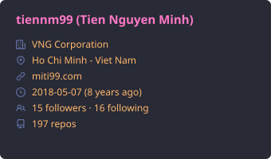</td><td>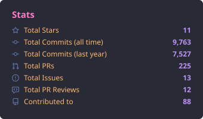</td></tr>
<tr><td>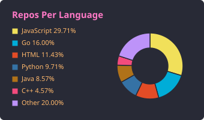</td><td>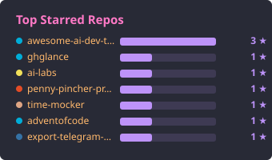</td></tr>
<tr><td>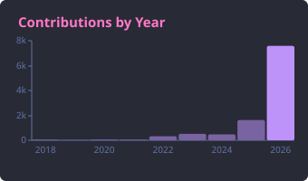</td><td>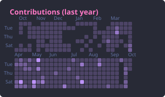</td></tr>
<tr><td>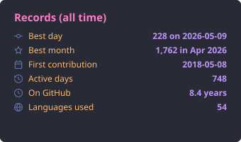</td><td>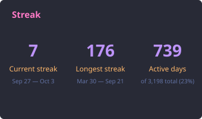</td></tr>
<tr><th>Last year</th><th>All time</th></tr>
<tr><td>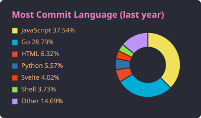</td><td>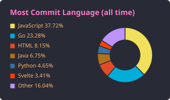</td></tr>
<tr><td>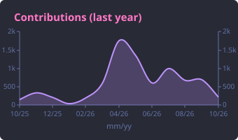</td><td>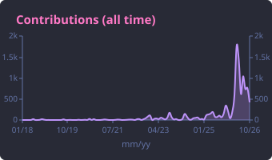</td></tr>
<tr><td>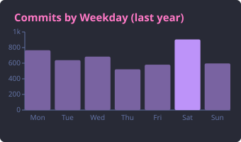</td><td>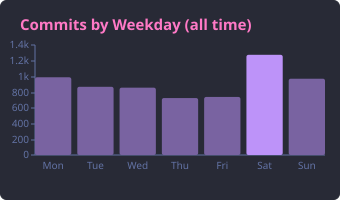</td></tr>
<tr><td>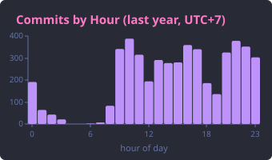</td><td>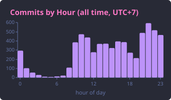</td></tr>
</table>

</div>

## In the wild

- [**tiennm99/tiennm99**](https://github.com/tiennm99/tiennm99) — author's profile README, refreshed daily via `tiennm99/ghglance@v1`. Two-per-row layout, dracula theme.

## Use as a GitHub Action (recommended)

Drop this in `.github/workflows/ghglance.yml` in your **profile repo** (the one
named after your username):

```yaml
name: ghglance

on:
  schedule:
    - cron: "0 0 * * *" # daily
  workflow_dispatch:

permissions:
  contents: write

jobs:
  cards:
    runs-on: ubuntu-latest
    steps:
      - uses: actions/checkout@v5
      - uses: tiennm99/ghglance@v1
        with:
          user: ${{ github.repository_owner }}
          token: ${{ secrets.GHGLANCE_TOKEN }}   # classic PAT with read:user + repo
          themes: dracula,github_dark,tokyonight
          tz: Asia/Saigon
          include_forks: "true"
          include_private: "true"
          include_org_repos: "false"  # "true" also counts org repos you administer (token needs read:org)
          commit_changes: "true"
```

Then embed the cards in your `README.md`:

```md


```

### Action inputs

| Input              | Default                          | Description                                                             |
| ------------------ | -------------------------------- | ----------------------------------------------------------------------- |
| `user`             | —                                | GitHub username (required)                                              |
| `token`            | `${{ github.token }}`            | PAT with `read:user` + `repo` for private repo stats                    |
| `out`              | `output`                         | Output directory                                                        |
| `themes`           | `dracula`                        | Comma-separated theme ids, or `all`                                     |
| `tz`               | `UTC`                            | IANA tz for the productive-time card (e.g. `Asia/Saigon`)               |
| `start_of_week`    | `sunday`                         | First day of week for heatmap rows and weekday bars (`sunday`…`saturday`) |
| `top_repos`        | `0`                              | Optional cap on seed repos probed for commit history (`0` = unlimited)  |
| `commits_per_repo` | `500`                            | Max commits sampled per repo, `0` = every commit (covers last-year and all-time aggregates) |
| `include_forks`    | `true`                           | Include forked repos in stats and commit probing                        |
| `include_private`  | `true`                           | Include private repos (requires PAT with `repo` scope; silently no-op otherwise) |
| `include_org_repos`| `false`                          | Count org-owned repos you administer toward stars, repo count, languages, top-starred (needs `read:org`) |
| `commit_changes`   | `false`                          | Commit generated cards back to the repo                                 |
| `commit_message`   | `chore: update ghglance cards`    | Commit message                                                          |
| `commit_branch`    | *(current ref)*                  | Target branch for auto-commit                                           |
| `author_name`      | `github-actions[bot]`            | Commit author                                                           |
| `author_email`     | `…@users.noreply.github.com`     | Commit email                                                            |

## Use as a CLI

```sh
go install github.com/tiennm99/ghglance@latest
```

Or build from source:

```sh
git clone https://github.com/tiennm99/ghglance
cd ghglance
go build -o ghglance .
```

Then:

```sh
export GITHUB_TOKEN=ghp_xxx
ghglance -user tiennm99 -themes dracula,github_dark -tz Asia/Saigon -out output
```

Add `-include-org-repos` to also count org-owned repos you administer:

```sh
ghglance -user tiennm99 -themes dracula -include-org-repos -out output
```

| Flag                | Default         | Description                                                            |
| ------------------- | --------------- | ---------------------------------------------------------------------- |
| `-user`             | *(required)*    | GitHub username                                                        |
| `-token`            | `$GITHUB_TOKEN` | Personal access token (not used by `-serve`)                           |
| `-out`              | `output`        | Output directory (`<out>/<theme>/…svg`)                                |
| `-themes`           | `dracula`       | Comma-separated theme ids, or `all`                                    |
| `-tz`               | `Local`         | IANA timezone for productive-time cards                                |
| `-start-of-week`    | `sunday`        | First day of week for heatmap rows and weekday bars (`sunday`…`saturday`) |
| `-top-repos`        | `0`             | Optional cap on seed repos probed (`0` = unlimited)                    |
| `-commits-per-repo` | `500`           | Max commits sampled per repo, `0` = every commit                       |
| `-include-forks`    | `true`          | Include forked repos in the stats                                      |
| `-include-private`  | `true`          | Include private repos (requires `repo` PAT scope; silently no-op otherwise) |
| `-include-org-repos`| `false`         | Count org-owned repos you administer toward stars, repo count, languages, top-starred |
| `-timeout`          | `30m`           | Overall fetch deadline (per generation job under `-serve`), `0` = no limit |
| `-list-themes`      |                 | Print available theme ids and exit                                     |
| `-serve`            |                 | Run the [web UI](#run-the-web-ui) on this address (e.g. `:8080`) instead of generating once |
| `-data-dir`         | `data`          | Web UI only: directory holding generated cards                         |
| `-cooldown`         | `6h`            | Web UI only: minimum age of a user's cards before a sign-in or token for another account regenerates them |
| `-retention`        | `24h`           | Web UI only: delete a user's cards this long after they were generated, `0` = keep forever |
| `-workers`          | `2`             | Web UI only: concurrent generation jobs                                |
| `-oauth-client-id`  | `$GHGLANCE_OAUTH_CLIENT_ID` | Web UI only, required: GitHub OAuth App client ID for [Sign in with GitHub](#sign-in-with-github) |
| `-oauth-client-secret` | `$GHGLANCE_OAUTH_CLIENT_SECRET` | Web UI only, required: that OAuth App's client secret (never printed by `-help`) |
| `-public-url`       | `$GHGLANCE_PUBLIC_URL` | Web UI only, required: the site's external origin; the OAuth callback is `<public-url>/auth/callback` |

The web UI flags above (`-serve` through `-public-url`) are server-only:
the Action (`action.yml`, `entrypoint.sh`) does not expose them.

## Run the web UI

`-serve` turns the binary into a small web app for quickly viewing
profile cards: a form takes a GitHub username plus options, the visitor
signs in with GitHub or pastes their own token, a background job renders
all sixteen cards in every theme on that token, and `/u/<username>` shows
them with a theme picker. Cards are stored on disk and survive restarts.

The web UI is for viewing, not hosting: cards are inlined into the page as
`data:` URIs, so there is no card URL to link to or put in Markdown. To
show cards in a README, use the [GitHub Action](#use-as-a-github-action-recommended)
or the [CLI](#use-as-a-cli).

The server has no GitHub token of its own. [Sign in with
GitHub](#sign-in-with-github) must be configured: `-serve` refuses to start
until the OAuth client ID, client secret and public URL are all set.

```sh
export GHGLANCE_OAUTH_CLIENT_SECRET=xxxx   # keep the secret out of the command line
ghglance -serve :8080 -data-dir data -retention 24h \
  -oauth-client-id Ov23xxxx -public-url http://localhost:8080
# open http://localhost:8080
```

| Path | Serves |
| --- | --- |
| `/` | The submission form |
| `/u/<user>` | The user's cards inlined as `data:` images (`?theme=<id>` picks the theme), or job progress while one runs |
| `/u/<user>/status` | Job status as JSON, polled by the progress page |
| `/auth/start` | Validates the form, then queues the job on a pasted token or redirects to GitHub's consent page |
| `/auth/callback` | Finishes the sign-in and queues the job |
| `/healthz` | Liveness probe |

How submissions are handled:

- **Every job runs on the visitor's token**: a sign-in token, or one they
  paste (see [Use your own token](#use-your-own-token)). The token is used
  for that one job only: never logged, never written to disk. A token for
  the username being generated keeps the ticked private and org repos and
  skips the cooldown. A token for someone else renders public data only,
  does not skip the cooldown, and is refused outright if it can read
  private repositories. The cards are visible on the site to anyone with
  the page link.
- **Failures.** A job that fails or times out at any fetch stage publishes
  nothing, so an earlier complete set stays in place.
- **Cooldown.** Cards younger than `-cooldown` are not regenerated with a
  sign-in or token for another account; the owner's own token skips the
  wait.
- **Retention.** Cards are deleted `-retention` (default `24h`) after they
  were generated, checked at startup and hourly. The user's page then
  offers a fresh generation.
- **Limits.** One queued or running job per user, `-workers` jobs at once,
  `-timeout` per job, and five submissions per client followed by one
  every two minutes. A client is an IPv4 address or an IPv6 /64. Behind a
  reverse proxy on a private or loopback address, the client address comes
  from the last `X-Forwarded-For` hop.

### Sign in with GitHub

A visitor ticks their options, clicks **Sign in with GitHub & generate**,
approves once on GitHub, and lands on their cards page while the job runs.

- **Scopes follow the ticks**, never more: `read:user` for public data;
  `repo read:user` when private repos are ticked (GitHub has no read-only
  private scope); plus `read:org` when org repos are ticked too. The page
  shows the list next to the button and updates it as boxes change.
  Private repos start unticked.
- **One token per generation.** The server exchanges GitHub's code (with
  `state` bound to a short-lived cookie and PKCE `S256`) for a token, runs
  one job with it, then revokes it through GitHub's API, whether the job
  succeeded, failed or was dropped at shutdown. The token is never logged,
  stored or sent to the browser.
- **Fewer permissions granted than asked** downgrade the job to what was
  granted, and the user's page says so. Cancelling on GitHub returns to the
  form with the options kept.
- **More permissions granted than asked** stop the sign-in: GitHub folds
  every scope a user once granted the app into each new token, so a
  public-only sign-in after an earlier private one comes back with `repo`.
  The token is revoked, nothing is generated, and the form explains how to
  match the ticks or revoke the app under GitHub **Settings > Applications
  > Authorized OAuth Apps**.
- **Another account.** Signing in as `alice` to generate `bob` renders
  public data only, and is refused if private repos were ticked (the token
  would then read private repos); untick them to generate someone else.

The browser binding cookie is `__Host-ghglance_oauth` when the public URL
is https, so another site on a sibling subdomain cannot plant it. A plain
`http://` public URL cannot use that prefix, which leaves the binding
weaker; use https outside local testing.

To set it up, register an OAuth App: GitHub **Settings > Developer
settings > OAuth Apps > New OAuth App**, with

- **Homepage URL**: the site's address, e.g. `https://ghglance.example.com`
- **Authorization callback URL**: `<public-url>/auth/callback`, e.g.
  `https://ghglance.example.com/auth/callback`

Then generate a client secret and give the server all three values
(`-oauth-client-id`, `-oauth-client-secret`, `-public-url`, or the
`GHGLANCE_OAUTH_CLIENT_ID`, `GHGLANCE_OAUTH_CLIENT_SECRET` and
`GHGLANCE_PUBLIC_URL` environment variables). With any of them missing,
`-serve` exits at startup with an error naming the missing settings.

### Use your own token

Below the sign-in button, a collapsed **Or use your own token** section
takes a token the visitor creates themselves. Its **Create a token on
GitHub** button opens GitHub's new classic token page with `repo` and
`read:user` pre-ticked.

- A non-empty token takes precedence over signing in, whichever button is
  pressed, so Enter in the token field never starts a sign-in.
- It goes through the same validation, rate limit, queue, ownership,
  privacy and cooldown rules as a sign-in token.
- It is used for that one generation only and never stored, logged or
  echoed back into the form. It is not revoked: it belongs to the
  visitor, who deletes it on GitHub when done.

Each user takes about 9 MB on disk for an active profile (16 cards × every theme).

### Deploy with Docker Compose or Coolify

[`compose.yml`](./compose.yml) builds the repo's `Dockerfile`, runs
`ghglance -serve :8080 -data-dir /data`, keeps cards in the `ghglance-data`
volume, and health-checks `/healthz`. It publishes no host port: Coolify's
proxy routes the domain it generates for `SERVICE_FQDN_GHGLANCE_8080` to
port 8080 in the container.

In Coolify:

1. Create a resource from this Git repository with the **Docker Compose**
   build pack and compose file `/compose.yml`.
2. Register the [OAuth App](#sign-in-with-github) and set
   `GHGLANCE_OAUTH_CLIENT_ID`, `GHGLANCE_OAUTH_CLIENT_SECRET` and
   `GHGLANCE_PUBLIC_URL` (see [`.env.example`](./.env.example)); the public
   URL is the domain from step 3, e.g. `https://ghglance.sg.miti99.com`.
   `compose.yml` requires all three and refuses to start without them.
3. Keep the generated domain or set your own on the `ghglance` service, then
   deploy.

On a plain Docker host, copy `.env.example` to `.env`, fill in the three
sign-in values, add a `ports: ["8080:8080"]` entry to the service, and run
(`.dockerignore` keeps `.env` and `data/` out of the image context):

```sh
docker compose up -d --build
```

The Action image is unchanged: `compose.yml` overrides the entrypoint, so
the Action still runs `entrypoint.sh`.

## How attribution works

**Repo sampling** uses a seed list built from `contributionsCollection.commitContributionsByRepository`, unioned across every active contribution year. This catches every repo you've committed in — not just your top-starred ones. Each year is queried a quarter at a time: the API caps that field at 100 repos per query and drops the rest without saying so, which a prolific year hits easily. A quarter that still comes back at the cap is re-asked month by month to recover the tail.

**Which repos count where.** The commit-driven cards (most-commit-language, productive time, productive weekday, and everything derived from the contribution calendar) cover repos in *any* namespace you committed to — your own, your orgs', and upstream repos you sent PRs to. The repo-driven cards (stars, repo count, repos-per-language, top-starred) look only at repos you own. Set `include_org_repos` / `-include-org-repos` to also count org-owned repos where your permission is `ADMIN`; org repos you merely have read or write access to are never counted.

**Commit-to-language** is byte-weighted: each commit credits every language in the repo, proportional to linguist's byte share. A commit to a 60% Go / 40% Python repo adds 0.6 to Go and 0.4 to Python, regardless of which file was touched. Caveats:

- Linguist excludes prose (Markdown, AsciiDoc, reST) from byte counts, so heavily-Markdown repos skew toward whatever small code fraction linguist did detect.
- For per-file accuracy, a future `-accurate-languages` mode is planned (per-commit REST + go-enry).

**Cost per run** (current defaults, typical user):
- ~1 profile query + ~4 queries per active year (+3 for any quarter that saturates) + ~50 commit-history pages ≈ **80-100 GraphQL calls**.
- Zero REST calls. Well under the 5000 points/hr budget.

## Themes

Run `ghglance -list-themes` for the full list (65 themes ported from
github-profile-summary-cards). Built-ins include `default`, `dark`, `dracula`,
`github`, `github_dark`, `tokyonight`, `onedark`, `nord_dark`, `nord_bright`,
`gruvbox`, `radical`, `synthwave`, `monokai`, `solarized`, `solarized_dark`,
`transparent`, and more. Preview every one against real profile data in the
[demo gallery](./demo).

## Output

```
output/
  dracula/
    profile-details.svg
    repos-per-language.svg
    most-commit-language.svg
    stats.svg
    productive-time.svg
    productive-weekday.svg
    contributions.svg
    contributions-heatmap.svg
    top-starred-repos.svg
    streak.svg
    most-commit-language-all-time.svg
    productive-time-all-time.svg
    productive-weekday-all-time.svg
    contributions-all-time.svg
    contributions-by-year.svg
    records.svg
```

`output/` is entirely gitignored — it's regenerated on each run. For a
reference render of every card in every theme, see the CI-built
[`demo/`](./demo) gallery instead.

## Tokens & permissions

The default `${{ github.token }}` can read public user data but will not see
your private-repo commits. For accurate stats, create a **classic** personal
access token with `read:user` and `repo`, save it as a repo secret (e.g.
`GHGLANCE_TOKEN`), and pass it via the `token` input. `include_private`
defaults to `true` so those commits are counted automatically once the token
has `repo` scope; pass `include_private: "false"` if you want to keep private
work out of the rendered cards even when the token can see it.

Enabling `include_org_repos` additionally needs `read:org` on the token, and
SSO authorization for any org that enforces it — otherwise those repos stay
invisible and the input silently changes nothing.

## Credits & inspiration

- [**github-profile-summary-cards**](https://github.com/vn7n24fzkq/github-profile-summary-cards) by [@vn7n24fzkq](https://github.com/vn7n24fzkq) — card layout, chart styles, theme palette, Octicon selection, and output structure.

## License

Apache-2.0 — see [LICENSE](LICENSE).
